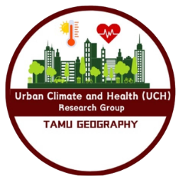

# HeatWise AI

**Personalized, thermal-risk-aware routing for safer travel during extreme heat**

[Open the live HeatWise AI application](https://heatwise-ai-fortyguard.onrender.com/)

HeatWise AI is an interactive route-planning and urban-heat decision-support
tool developed for the Texas A&M University and RELLIS campuses. Instead of
choosing a route only by distance or travel time, it compares three options:

- **Fastest** — minimizes travel time.
- **Lowest Heat Risk** — minimizes accumulated outdoor thermal exposure.
- **Balanced** — trades a small increase in travel time for lower heat exposure.

The project was developed by the **Urban Climate and Health (UCH) Research
Group, Department of Geography, Texas A&M University**, for the **FortyGuard
Hackathon '26**.




## Project goal

Heat exposure along a walking or cycling route is not determined by air
temperature alone. HeatWise AI combines hyperlocal temperature with humidity,
wind, solar radiation, shade, surrounding urban form, activity, age, and
clothing. Its goal is to help users understand and reduce outdoor heat exposure
while preserving a practical travel time.

The application is a research and screening prototype. It does not provide a
medical diagnosis or guarantee that a route is safe.

## What the application does

1. Retrieves an exact-hour, 100 m hyperlocal temperature grid from the
   **FortyGuard Temperature API®**.
2. Retrieves hourly humidity, 10 m wind, cloud cover, and precipitation from
   Open-Meteo, with an exact-hour NWS/NOAA fallback when the public host is
   rate-limited.
3. Uses USGS 3DEP LiDAR-derived tree-canopy and building heights to calculate
   sky-view factor and time-dependent shade from the selected hour's solar
   elevation and azimuth.
4. Adjusts 10 m weather wind to pedestrian height using a logarithmic wind
   profile and locally derived aerodynamic roughness.
5. Calculates segment-level mean radiant temperature, UTCI, and
   activity-sensitive PET.
6. Routes users through OpenStreetMap pedestrian or bicycle networks and
   compares travel time, temperature, shade, UTCI, PET, and exposure load.

All live environmental inputs are tied to the same College Station local-hour
timestamp. If the exact-hour temperature or weather layer is unavailable, the
application does not silently combine it with a different hour.

## Scientific framework

| Output | Meaning | Main inputs |
|---|---|---|
| Air temperature | FortyGuard route-level thermal layer | FortyGuard Temperature API® |
| Mean radiant temperature (MRT) | Combined short- and long-wave radiant environment | SolarCal, radiation, LiDAR shade/SVF, albedo, humidity, cloud |
| UTCI | Standardized environmental outdoor heat-stress equivalent temperature | Air temperature, MRT, relative humidity, 10 m wind |
| Activity-sensitive PET | Physiological equivalent temperature for the selected profile | Air temperature, MRT, 2 m wind, humidity, activity MET, clothing, age |
| Exposure load | Thermal stress above a threshold integrated over route duration | UTCI or PET and time on each route segment |

UTCI and PET are **equivalent temperatures**, not measurements of air
temperature or body temperature. They can be substantially higher than a phone
weather application's “feels like” value because HeatWise includes the radiant
environment of the actual route. The phone value commonly represents a shaded
weather-station condition and does not include route-specific solar exposure,
activity, or clothing.

Walking, cycling, and jogging use representative metabolic intensities of 3.3,
6.8, and 7.0 MET. The user can also select clothing insulation and age group.
UTCI remains an activity-independent environmental index; personalization is
reported separately through PET.

### Current scientific scope

- MRT uses the ASHRAE 55 SolarCal framework plus a cloud-adjusted long-wave
  baseline. It is an engineering estimate, not a complete SOLWEIG simulation.
- Shade is calculated from 16-direction LiDAR horizon profiles for trees and
  buildings and updated using the selected hour's solar geometry.
- Pedestrian wind is modeled from 10 m wind and local roughness; it is not a
  direct 2 m field measurement.
- PET is calculated for route-representative environmental conditions to keep
  the public application responsive.

## Data sources

| Component | Source |
|---|---|
| Hyperlocal temperature | FortyGuard Temperature API® |
| Hourly meteorology | Open-Meteo; NWS/NOAA exact-hour fallback |
| Pedestrian and bicycle routing | OpenStreetMap / OSMnx |
| Canopy and building height | USGS 3DEP LiDAR-derived rasters |
| Solar position | NOAA solar-position equations |
| Basemap and location search | Mapbox |

## Run locally

```bash
python3 -m venv .venv
source .venv/bin/activate
pip install -r requirements.txt
cp .env.example .env
streamlit run app.py
```

Add credentials only to `.env`; this file is excluded from Git.

```dotenv
FORTYGUARD_API_KEY=...
FORTYGUARD_BASE_URL=https://api.fortyguard.com
MAPBOX_ACCESS_TOKEN=...
GROQ_API_KEY=... # optional conversational assistant
```

## Tests

```bash
python -m pytest -q
```

## Repository structure

- `app.py` — Streamlit user interface
- `heatwise/` — routing, weather, shade, wind, UTCI/PET, maps, and assistant
- `data/osm/` — processed walking/cycling networks and building footprints
- `data/lidar/` — compact LiDAR-derived rasters and horizon profiles
- `fortyguard/` — FortyGuard asynchronous API client
- `tests/` — calculation and integration tests

## Key references

- Bröde et al. (2012), UTCI operational procedure:
  <https://doi.org/10.1007/s00484-011-0454-1>
- ISO 14505-2, ergonomic evaluation of thermal environments:
  <https://www.iso.org/standard/79771.html>
- Höppe (1999), Physiological Equivalent Temperature:
  <https://doi.org/10.1007/s004840050118>
- ASHRAE Standard 55, thermal environmental conditions:
  <https://www.ashrae.org/technical-resources/bookstore/standard-55-thermal-environmental-conditions-for-human-occupancy>
- 2024 Adult Compendium of Physical Activities:
  <https://pacompendium.com/>
